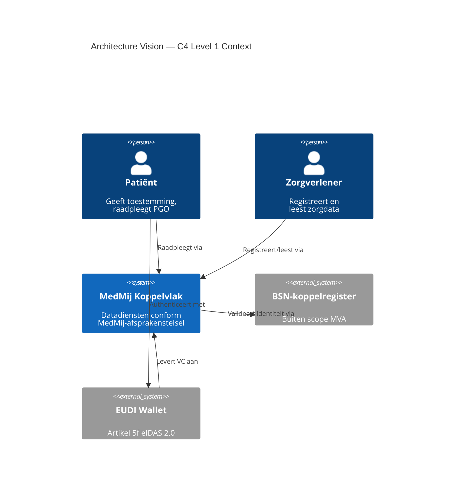
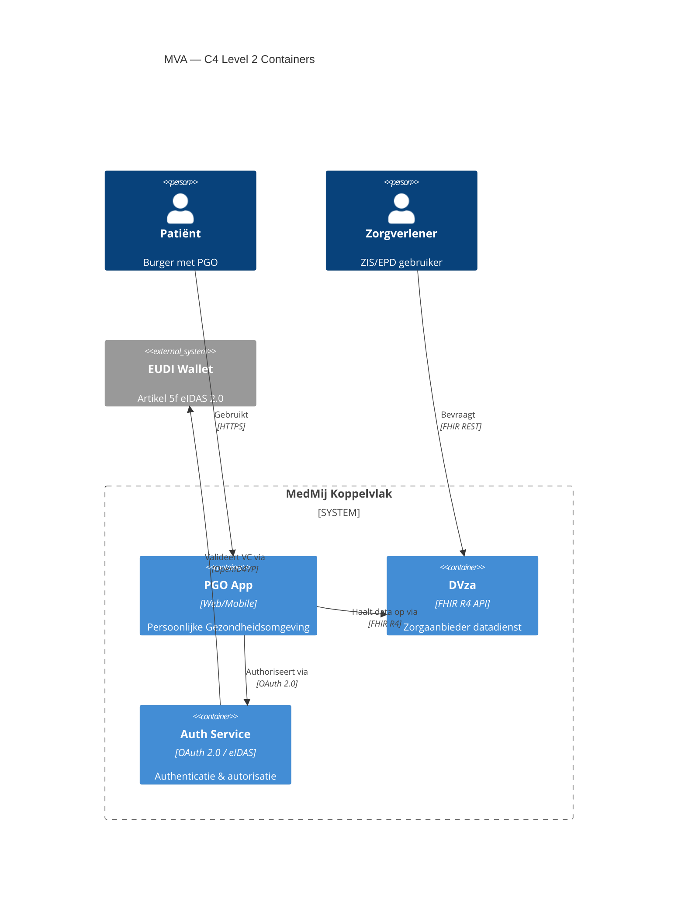

# CLAUDE.md — Essence Way of Working

This file primes you on the conventions of this project. **Read it fully before making any changes.** Everything below is deliberate; if you want to change a decision, surface the reason and ask first.

---

## What this project is

A composed Essence way of working delivered as a set of static HTML "card decks", a 36-slide HTML training presentation, and a polished Excel assessment workbook. It explains the OMG/SEMAT Essence standard, composes four practices (Business Scenarios, Service Blueprint, MVA, MVG) on the Essence kernel, and lets a team measure progress by alpha state. The audience is enterprise architects working with **buy-and-configure COTS**, not bespoke software development.

The HTML files are hosted as a private GitHub Pages site.

---

## Project structure

```
.
├── index.html                                       # thin redirect → essence-introduction.html
├── essence-introduction.html                        # hub / front door
├── essence-kernel.html                              # kernel reference deck
├── business-scenarios-essence-practice.html         # practice deck
├── service-blueprint-essence-practice.html          # practice deck
├── mva-essence-practice.html                        # practice deck
├── mvg-essence-practice.html                        # practice deck
├── essence-training.html                            # 36-slide HTML training presentation
├── EA_Alpha_Assessment.xlsx                         # assessment workbook (generated)
├── build/
│   ├── build_xlsx.py                                # openpyxl builder for EA_Alpha_Assessment.xlsx — source of truth
│   └── build_templates.py                           # python-docx + openpyxl builder for MVA work product templates
├── docs/
│   ├── wp/                                          # MVA work product detail pages
│   │   ├── mva-*.html                               # 7 detail pages (one per work product)
│   │   ├── dsl/                                     # Structurizr DSL workspaces voor Architecture Vision & Definition
│   │   │   ├── mva-architecture-vision.dsl          # DSL bronbestand — handmatig onderhouden
│   │   │   ├── mva-architecture-definition.dsl      # DSL bronbestand — handmatig onderhouden
│   │   │   └── json/                                # Workspace JSON-exports
│   │   ├── img/                                     # Diagrams — handmatig toegevoegd door de architect
│   │   │   ├── mva-architecture-vision.png          # C4 Level 1 Context diagram
│   │   │   └── mva-architecture-definition.png      # C4 Level 2 Container diagram
│   │   └── downloads/                               # Generated Word (.docx) and Excel (.xlsx) templates
├── README.md
├── CLAUDE.md                                        # this file
└── .github/workflows/pages.yml                      # GitHub Pages deploy
```

---

## Visual & design system

Every HTML file shares one aesthetic. **Don't drift from it.**

**Typography** (loaded from Google Fonts in every file):
- `Fraunces` (serif, 9..144 wght) — display, h1, h4, hero titles.
- `IBM Plex Sans` — body.
- `IBM Plex Mono` — kickers, labels, code-ish elements.

**Colour palette** (CSS variables on `:root`):
- Paper `#f3efe6`, paper-2 `#ece6d8`, ink `#1c1a16`, ink-soft `#524d42`, line `#d8d0bf`, card `#fbf9f3`.
- **Element-type accents** (used inside any deck): alpha `#0f6e63`, work-product `#bb7a16`, activity `#1f5fa8`, competency `#4b3f9e`, role `#9c3f76`, pattern `#b1492e`.
- **Practice / deck accents** (sets `--prac` on the practice's own deck):
  - Kernel `#27406b` (navy)
  - MVA `#0f6e63` (green)
  - MVG `#4b3f9e` (indigo)
  - Business Scenarios `#0e7490` (cyan)
  - Service Blueprint `#b21e63` (rose)
  - Introduction hub `#243b66` (navy)
- **Area accents**: Customer `#2e7d52` (green), Solution `#b07d12` (gold), Endeavor `#2a5e9c` (blue).
- **Level accents**: Enterprise `#27406B`, Solution `#0F6E63`, Spans `#4B3F9E`, Component `#6b6256`.

**Layout conventions** for every deck:
- Hero band: kicker (mono caps) → h1 (Fraunces) → lede → pillars (mono pills) → plug strip (4 boxes).
- Sticky toolbar with type filters (`All / Alphas / Activities / Work Products / Roles / Patterns`) + Print button.
- Sections of cards in a `.grid` (`repeat(auto-fill, minmax(300px, 1fr))`).
- Subtle dotted grid background via `body::before` with radial mask.
- Print stylesheet always present (`@media print`).

**Card deck JS pattern** (look at any practice deck before changing):
- `const E = h => {...}` template-to-element helper.
- `sec(type, color, title, intro)` builds a `<section>` with a grid.
- Data-driven arrays — `acts`, `products`, `roles`, `pats` — mapped to `appendChild(E(...))`.
- **Extend the arrays. Don't hand-write card markup. Don't replace the pattern.**

---

## The composed way of working

| Practice | Owns | Advances | Natural level |
|---|---|---|---|
| **Business Scenarios** | `Business Scenario` (sub-alpha, BS practice) | Opportunity → Value Established, Stakeholders → In Agreement, Requirements → Bounded, Architectural Drivers → Quantified | Enterprise / capability |
| **Service Blueprint** | `Service Blueprint` (sub-alpha) | Requirements → Acceptable, Stakeholders → In Agreement, System → Architecture Selected (via high-level design), Opportunity → Value Established | Solution / service |
| **MVA** | Architectural Drivers, Architecture, Architecture Decisions, `Paved Road` (sub-alpha of Architecture) | Above + System → Demonstrable | The level of its System |
| **MVG** | Governance | Governance → Effective, Way of Working → Foundation Established | Spans levels |

---

## Modeling decisions (deliberate — don't undo without reason)

1. **Renamed kernel "Software System" → "System"** so it scales (enterprise / solution / component). The kernel deck notes that System extends Software System.
2. **Paved Road is a sub-alpha of Architecture**, not a separate alpha. *Conduct Architecture Review* is the activity (the verb); the paved road is the noun (the thing you progress).
3. **Architectural Drivers, Architecture, Architecture Decisions stay first-class** (not sub-alphas of System) — they are forces / reasoning / discipline, not parts of one system. See levels-of-scale framing.
4. **Service Blueprint has six states**: Scoped → Frontstage Mapped → Blueprinted → **Specified** → Validated → In Operation. The *Specified* state covers "requirements specified + high-level service design outlined" — both are SB outputs that hand to MVA.
5. **Service is defined explicitly** in the SB deck: *"A service is an interaction of an organisation with its environment to achieve a specific goal that has value for a customer."* Lead with this in any SB-related content.
6. **Customer Journey Map is NOT a Service Blueprint work product**. Per NN/g it's the customer's emotional view, distinct from the blueprint's provider-and-customer operational view. It's a companion input only, named in the composition panel.
7. **No fitness functions in MVA**. The COTS context made them a poor fit. Conformance is by *paved-road adoption* + *architecture-review outcomes*, feeding MVG's Governance alpha.
8. **MVG governs by guardrails, not gates.** Decisions flow inside the guardrails; only exceptions are reviewed. No stage gates.

---

## Levels of scale

The System alpha is the **system of interest** and it is fractal: `enterprise ⊃ solution ⊃ component`. The same kernel + practices instantiate at any level; what is a *System* at one level is a *sub-system* at the level above.

**These decks operate at the solution level**, drawing on an enterprise that already provides the paved road, drivers and governance.

When extending:
- Don't bind a practice to a level structurally — use the *"natural home level"* annotation (a `Level · …` pillar in the hero, and a `level` field in the intro page's `practices` array).
- Practices are **level-agnostic** by design.
- The intro page has a "Levels of Scale" section with a nested visual (Enterprise → Solution → Component) and a "Which practice runs where" panel. Mirror those when relevant.

---

## The assessment workbook

`EA_Alpha_Assessment.xlsx` is generated from `build/build_xlsx.py`. **The Python is the source of truth.** Never edit the xlsx by hand.

After any change to the builder:

1. `python build/build_xlsx.py`
2. Open in Excel or LibreOffice and visually verify; **zero formula errors required**.

### Structure

- **Dashboard** (first tab, INK colour) — KPI tiles, area-grouped table, owner chip, level chip, current-state, data-bar progress, target state, status. Links into each alpha tab.
- **Levels of Scale** (second tab, navy) — orientation: nested levels visual + "which practice runs where" + the explicit statement that this is a solution-level assessment.
- **14 alpha tabs** — Customer / Solution / Endeavor groups, one per alpha.

### Per-alpha tab layout (do **not** break — Dashboard depends on cell positions)

| Cell(s) | Contents |
|---|---|
| `B1` | "← Dashboard" hyperlink |
| `B2:D2` merged | Alpha title (owner colour fill, white) |
| `E2` | Level chip (Enterprise / Solution / Spans, level colour fill) |
| `B3:E3` merged | Description |
| Row 4 | KPI labels |
| `B5` | Current state — `=IF(M3=0,"Not started",INDEX(G7:G…,M3))` |
| `C5` | Progress % — `=IF(M2=0,0,M1/M2)` |
| `D5` | States achieved — `=M4&" / "&n` |
| `E5` | Owner · Area (static text) |
| Row 6 | Table header band (STATE / ✔ / CHECKLIST ITEM / STATE STATUS) |
| Row 7+ | State groups: col B merged vertically (state name, owner colour); col C is the `✔` checkbox column with data-validation list; col D wrapped checklist text; col E merged vertically (status COUNTIF formula) |
| `G7..K…` (hidden) | Per-state helper: name / done / total / achieved / contiguous-product |
| `M1..M4` (hidden) | Totals: done, total, current-state index, achieved count |

Tab colour = **area** (Customer green, Solution gold, Endeavor blue).
Header band colour = **owner** (Kernel navy, MVA green, MVG indigo, BS cyan, SB rose).
Level chip colour = **level**.

### Dashboard formula contract

- Per alpha row: current state = `='Tab Name'!$B$5`, progress = `='Tab Name'!$C$5`, done = `='Tab Name'!$M$1`, total = `='Tab Name'!$M$2`.
- Status = `IF(F{r}>=1,"✔ Complete",IF(F{r}>0,"● In progress","○ Not started"))`.
- Data bar on the progress column. Status colour via conditional formatting on the leading character.

### Sample data

The workbook ships pre-filled with a coherent mid-project sample so the visuals are alive. Per alpha, `sample=(full_states, partial_in_next)`. To produce a blank assessment, clear all `✔` cells — formulas recompute automatically.

---

## How to extend

**Add a new state to an existing alpha**: update the `alpha(...)` call's `states` list in `build_xlsx.py` (name + checklist items), and update the corresponding sub-alpha card in the relevant practice deck HTML. Rebuild the workbook.

**Add a new alpha or sub-alpha**: add a new `alpha(name, owner, area, target, desc, states, sample)` call in `build_xlsx.py`. Add it to the relevant deck's alpha section. Update the deck's plug-strip counts and "what it advances" line. Update the intro page's coverage table.

**Add a new practice**: create `<name>-essence-practice.html` from an existing practice deck as a template (MVA or MVG are the cleanest). Add a link card to it in `essence-introduction.html`'s `practices` array. Add a slide pair (what + when) to `essence-training.html`. If the practice introduces new alphas, add them to the workbook.

**Always reflect changes across all artifacts**: practice deck → intro page → training deck → workbook.

---
## Doel

Dit document beschrijft hoe wij C4-diagrammen maken binnen de MedMij/enterprise
architecture context. We volgen de C4 Model-niveaus en tekenen in ArchiMate-stijl,
conform de richtlijn van Sarrodie (Archi 4.7 blog post).

---

## C4-niveaus en TOGAF/MVA-mapping

| C4 Niveau | Naam            | TOGAF-deliverable                  | ArchiMate-laag        |
|-----------|-----------------|------------------------------------|-----------------------|
| Level 1   | Context         | Architecture Vision (one-pager)    | Business / Application |
| Level 2   | Containers      | MVA / Architecture Definition      | Application           |
| Level 3   | Components      | SAD / gedetailleerd ontwerp        | Application (intern)  |
| Level 4   | Code            | *buiten scope MVA*                 | —                     |

**Vuistregel:**
- De **Architecture Vision** toont altijd een C4 Context-diagram: het systeem,
  zijn gebruikers (Business Actors) en externe systemen.
- De **MVA** bevat minimaal één C4 Container-diagram per systeem in scope.
- Components worden alleen uitgewerkt als een ADR of plateauplan dat vereist.

---

## ArchiMate → C4 Elementmapping

Conform Sarrodie (Archi 4.7):

| C4 Concept       | ArchiMate Element       | Notitie                                      |
|------------------|-------------------------|----------------------------------------------|
| Person           | Business Actor          | Gebruik FontAwesome "user"-icoon indien mogelijk |
| Software System  | Application Component   | Stereotype-property: `[Software System]`     |
| Container        | Application Component   | Stereotype-property: `[Container: <tech>]`   |
| Component        | Application Function    | Stereotype-property: `[Component]`           |
| Relationship     | Triggering Relationship | Richting: caller → callee                    |

Labels op elementen volgen de Archi 4.7 Label Expression:

```
${name}
[${property:Stereotype}]
${documentation}
```

---

## Toolchain

### Primair: Structurizr DSL

Structurizr DSL is het aanbevolen bronformaat. Het is native C4, tekstueel,
versie-beheerbaar en produceert direct ArchiMate-compatibele SVG/PNG output.

**Lokaal draaien (geen cloud vereist):**

```bash
# Eenmalig: pull Structurizr Lite
docker pull structurizr/lite

# Start met een workspace-map
docker run -it --rm -p 8080:8080 \
  -v $(pwd)/workspace:/usr/local/structurizr \
  structurizr/lite
```

Open daarna http://localhost:8080 — live preview met export naar PNG/SVG.

**Minimale workspace.dsl:**

```dsl
workspace "MVA Context" "Architecture Vision — C4 Level 1" {

  model {
    # Personen (→ Business Actor)
    zorgverlener = person "Zorgverlener" "Raadpleegt en registreert zorgdata"
    patient      = person "Patiënt"      "Geeft toestemming, raadpleegt PGO"

    # Systeem in scope (→ Application Component [Software System])
    medmij = softwareSystem "MedMij Koppelvlak" "Regie op gegevens — datadiensten conform MedMij-afsprakenstelsel" {
      # Containers (Level 2) — alleen tonen in Container-diagram
      pgo_app = container "PGO App" "Persoonlijke Gezondheidsomgeving van de burger" "Web/Mobile"
      dvza    = container "DVza" "Zorgaanbiedersysteem dat data beschikbaar stelt" "FHIR R4 API"
      auth    = container "Autorisation Service" "OAuth 2.0 / eIDAS 2.0 authenticatie" "REST"
    }

    # Externe systemen (→ Application Component, buiten scope)
    bsn_k  = softwareSystem "BSN-koppelregister" "Extern — buiten scope MVA" {
      tags "External"
    }
    eudi   = softwareSystem "EUDI Wallet" "Artikel 5f eIDAS 2.0 — patiëntidentiteit" {
      tags "External"
    }

    # Relaties (→ Triggering Relationship)
    patient      -> medmij   "Raadpleegt zorgdata via"
    zorgverlener -> medmij   "Registreert en leest via"
    medmij       -> bsn_k    "Valideert identiteit via"
    patient      -> eudi     "Authenticeert met"
    eudi         -> medmij   "Levert verifieerbare credential aan"
  }

  views {
    # Level 1 — Context (Architecture Vision)
    systemContext medmij "Context" "C4 Level 1 — Architecture Vision" {
      include *
      autoLayout
    }

    # Level 2 — Containers (MVA)
    container medmij "Containers" "C4 Level 2 — MVA Architecture Definition" {
      include *
      autoLayout
    }

    styles {
      element "Person" {
        shape Person
        background #08427b
        color #ffffff
      }
      element "Software System" {
        background #1168bd
        color #ffffff
      }
      element "External" {
        background #999999
        color #ffffff
      }
      element "Container" {
        background #438dd5
        color #ffffff
      }
    }
  }
}
```

**Export naar PNG (CI/CD of CLI):**

```bash
# Structurizr CLI (apart van Lite)
docker run --rm \
  -v $(pwd):/usr/local/structurizr \
  structurizr/cli export \
  -workspace workspace.dsl \
  -format png
```

---

### Fallback: Mermaid C4

Gebruik Mermaid als Structurizr niet beschikbaar is (werkt in VS Code, GitLab,
GitHub, Confluence via plugin).

**Level 1 — Context:**



**Level 2 — Containers:**



---

## Werkwijze per deliverable

### Architecture Vision (één pagina)

1. Maak `context.dsl` (of Mermaid C4Context block)
2. Toon: systeem in scope, directe gebruikers, externe systemen
3. Maximaal ~15 elementen (conform Sarrodie's richtlijn)
4. Exporteer als PNG, embed in Vision-document
5. ArchiMate-annotatie: voeg `[Software System]` stereotype toe aan elk blok

### MVA / Architecture Definition

1. Maak `containers.dsl` (of Mermaid C4Container block)
2. Toon: alle containers binnen het systeem, hun technologie-stack, relaties
3. Externe systemen: grijs, label `[External]`
4. Exporteer als PNG per systeem in scope
5. Koppel elk container-element aan een ADR indien technologiekeuze gemaakt

---

## Conventies (conform Sarrodie + MedMij context)

- **Relaties** lopen altijd van caller naar callee (Triggering-richting)
- **Kleuren**: intern systeem `#1168bd`, container `#438dd5`, extern `#999999`, persoon `#08427b`
- **Stereotype-labels** altijd tonen: `[Software System]`, `[Container: <tech>]`
- **Beschrijving** in het element: maximaal 2 zinnen, functioneel (niet technisch)
- **Legenda** altijd opnemen in geëxporteerde PNG
- **Taal**: Nederlands voor namen en beschrijvingen; DSL-keywords blijven Engels
- **Maximale grootte**: Context-diagram ≤ 15 elementen; Container-diagram ≤ 20 elementen
- **Geen PlantUML**: PlantUML's C4-extensie biedt onvoldoende lay-outcontrole en
  introduceert een onnodige Graphviz-tussenlaag. Gebruik Structurizr DSL of Mermaid.

---

## Niet in scope

- C4 Level 4 (Code-diagrammen): vallen buiten MVA en Architecture Definition
- Sequence-diagrammen: gebruik apart UML-diagram of Mermaid `sequenceDiagram`
- Dynamic views: alleen bij expliciete vraag vanuit ADR of SEC-review

---
## Open follow-ons (work explicitly not yet done)

1. **Delivery / engineering / run practice** — the acknowledged gap. The current set leaves System → Operational, Requirements → Fulfilled, Stakeholders → Satisfied in Use, Opportunity → Benefit Accrued, Team and Work without a driving practice. The intro coverage table flags this honestly.
2. **Enterprise-scoped workbook companion** — the current workbook is solution-level. An enterprise-scoped companion would have System = the enterprise, solutions as sub-system tabs rolling up, paved road / governance / EA as enterprise-owned alphas.
3. **One-page A3 composition-map poster** — proposed but not built.

---

## Local commands

```bash
# Rebuild the workbook (the .py writes to the same path as the .xlsx in repo root,
# unless you've adjusted the save path — check before running)
python build/build_xlsx.py

# Preview the site locally
python -m http.server 8080      # then visit http://localhost:8080

# Git
git add -A && git commit -m "…" && git push
```

---

## Do / Don't quick reference

**Do**
- Keep the colour palette and typography consistent across every file.
- Preserve the workbook's per-tab cell contract; the Dashboard depends on it.
- Keep practice decks data-driven — extend the arrays, don't hand-write card markup.
- Reflect every change across **all** artifacts (deck → intro → training → workbook).
- Lead Service Blueprint content with the service definition.
- Use the level annotation; tag every practice and every alpha with its level.

**Don't**
- Add fitness functions to MVA — intentional COTS choice.
- Make the Customer Journey Map a Service Blueprint work product — companion input only.
- Bind practices to levels structurally — annotate, don't lock.
- Rewrite the JS card-deck pattern — extend it.
- Edit the workbook by hand — change `build_xlsx.py` and regenerate.
- Reintroduce "Software System" as a separate alpha — it's `System` now and extends Software System.
- **Commit or push without explicit user instruction.** Make the changes, show what was done, then wait for the user to say "commit" or "push".
