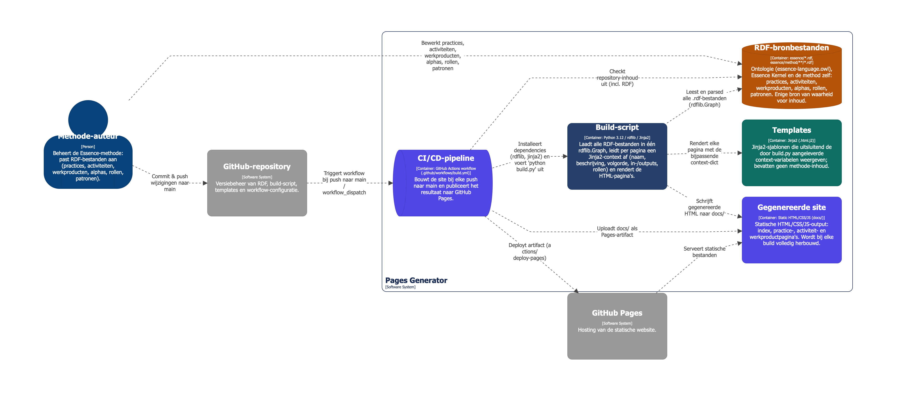

# Essence Architecture Method — GitHub Pages Generator

Een statische website die de **Essence Architecture Method** beschrijft (Enterprise Architecture, Solution Architecture, Architectuursturing, Verandermanagement- en Project-levenscyclus), volledig gegenereerd uit RDF-bronbestanden.

**RDF is de enige bron van waarheid.** Namen, beschrijvingen, volgorde van activiteiten, in-/outputs, rollen en patronen komen allemaal uit `essence/`. `build.py` en de Jinja2-templates in `templates/` bevatten geen inhoud — alleen logica om die RDF-data op te halen en weer te geven.

Live site: gepubliceerd via GitHub Pages vanuit de `docs/`-map (zie [Pipeline](#pipeline-github-actions)).

De volledige regels, het ontologie-overzicht en alle context-dictionary-schema's per template staan in [`CLAUDE.md`](CLAUDE.md). Dit document is het praktische startpunt: hoe de pijplijn in elkaar zit, hoe je lokaal draait, en hoe je wijzigt/uitbreidt.

## Architectuur

```
RDF (essence/)  --rdflib-->  Graph  --build.py-->  Jinja2 context  --templates/-->  HTML (docs/)
```

`build.py` laadt elk `.rdf`-bestand onder `essence/` in één `rdflib.Graph`, bouwt per pagina een context-`dict` met helperfuncties/graph-queries, en rendert die met een Jinja2-template naar `docs/`. Er zit geen tussenliggende JSON/YAML-laag: alles gaat rechtstreeks van graph naar template-context.

`docs/` is **gegenereerd** — niet handmatig bewerken, wordt bij elke build overschreven en bij elke push naar `main` opnieuw gebouwd door de CI-pipeline.

### Twee soorten practice-pagina's

Alle 5 practices renderen met hetzelfde template (`wow.html.j2`), maar `build_practice_ctx()` in `build.py` kiest tussen twee opbouwstrategieën op basis van `_is_phase_practice()`:

- **Activiteiten-gedreven practices** (enterprise-architecture, solution-architecture, architectural-governance) — activiteiten in volgorde, met in/output-werkproducten en rollen. Opgebouwd door `build_practice_ctx()` zelf.
- **Fase-gedreven practices** (project-lifecycle, change-management-lifecycle) — georganiseerd rond fases met gates ertussen (TOGAF-achtige governance-gates). Opgebouwd door `build_phase_practice_ctx()`, inclusief gate-status (`_gate_state`), welke activiteit een gate governeert (`_gate_govern_activity`), en levels-of-detail per fase (`_phase_lods`).

Of een practice als fase-gedreven telt, wordt afgeleid uit de RDF-structuur zelf (aanwezigheid van fase-elementen), niet uit een hardcoded lijst.

### Overzichtspagina's vs detailpagina's

Naast de methode-startpagina (`index.html`) en de per-item detailpagina's (`act/*.html`, `wp/*.html`, `role/*.html`, `alpha/*.html`, `practice/*.html`) genereert `build.py` vijf overzichtspagina's die alle instanties van een klasse tonen: `practices.html`, `activiteiten.html`, `workproducts.html`, `roles.html`, `alphas.html`. Deze overzichten worden volledig uit de graph opgebouwd (`build_practices_ctx()`, `build_activities_ctx()`, etc.) — de hoofdnavigatie (`templates/_base.html.j2`) linkt alleen naar deze vijf overzichten, nooit naar een individuele practice. **Een nieuwe practice hoeft dus niet in de navigatie te worden toegevoegd** — zodra hij in de RDF hangt, verschijnt hij vanzelf op `practices.html` en in alle relevante overzichten.

### Visuele configuratie die niet uit RDF komt

`build.py` bevat bovenin een klein blok bewuste, niet-inhoudelijke configuratie:

- **`PRACTICE_CFG`** — per practice-slug: kleur-key (altijd `"neutral"` — practices zijn nooit domein-gekleurd, zie CLAUDE.md), `spoor` (welk hoofdspoor in de navigatie/breadcrumbs), en SVG icon-path. **Nieuwe practice → nieuwe entry hier nodig**, anders ontbreekt het icoon/de styling op de kaart.
- **`AREA_OF_CONCERN_DOMAIN`** — vertaalt de RDF-tag-URI (`esk:CustomerAreaOfConcern` / `SolutionAreaOfConcern` / `EndeavorAreaOfConcern`) naar een interne kleursleutel. Puur technische mapping; welke Alpha/Activity welke area of concern heeft, staat in de RDF via `ess:tags`.
- **`DOMAIN_COLOR_CFG`** — de daadwerkelijke Tailwind-kleurklassen per domein (customer/solution/endeavour).
- **`ACTIVITY_SPACE_ORDER`** — de kernel-volgorde van Activity Spaces per area of concern (uit de OMG-spec), gebruikt om subgroepen op `activiteiten.html` te ordenen.

Geen van deze blokken bevat namen, beschrijvingen of andere inhoud die uit de RDF hoort te komen — alleen kleur/icoon/volgorde-configuratie.

### Downloadbare werkproduct-sjablonen (`wptemplates/`)

Een aantal werkproducten heeft een downloadbaar `.docx`-sjabloon. Dit is een apart, handmatig onderhouden systeem, los van de RDF→HTML-build:

1. `wptemplates/build_templates.py` genereert eenmalig `.docx`-sjablonen (met behulp van `_method.py`, dat titel/practice/herkomst uit de RDF leest, en `_builder.py`, een kleine docx-opmaakhelper). Dit script is **geen** onderdeel van `python build.py` — je draait het zelf, gericht:
   ```bash
   python3 wptemplates/build_templates.py                    # alleen ontbrekende sjablonen
   python3 wptemplates/build_templates.py paved-road         # alleen dit werkproduct
   python3 wptemplates/build_templates.py --force paved-road # bestaand sjabloon overschrijven
   ```
   Eenmaal gegenereerde `.docx`-bestanden worden nooit stilzwijgend overschreven — handmatige nabewerking blijft dus staan tot je expliciet `--force` gebruikt.
2. `build.py` (via `copy_downloads()`) kopieert bij elke gewone build alle bestanden die de RDF via `ess:content` op een `ess:TypedResource` (kind `type/template`) noemt, van `wptemplates/` (of `essence/`) naar `docs/downloads/`. Ontbreekt een referentied bestand, dan waarschuwt de build in plaats van stil te falen.

Een werkproduct krijgt dus alleen een downloadknop als de RDF een `ess:TypedResource`-kind `type/template` met een `ess:content`-URL heeft **en** het bijbehorende bestand in `wptemplates/` bestaat.

## Lokaal draaien

```bash
python -m venv .venv && source .venv/bin/activate
pip install -r requirements.txt   # rdflib, jinja2
python build.py
```

Open daarna `docs/index.html` in de browser, of serveer de map lokaal (nodig zodra pagina's relatieve fetch/nav.js-gedrag gebruiken):

```bash
python -m http.server -d docs 8000
```

`build.py` is idempotent en snel — draai hem na elke RDF- of template-wijziging opnieuw en herlaad de browser.

## De site aanpassen

### Inhoud wijzigen (namen, beschrijvingen, volgorde, in-/outputs, rollen, patronen)

Pas **alleen de RDF-bestanden** in `essence/method/` aan — nooit `build.py` of de templates voor inhoudelijke wijzigingen:

- Tekst van een activiteit/werkproduct/practice/rol/alpha → `ess:name` / `ess:briefDescription` / `ess:description` in het betreffende `.rdf`-bestand.
- Volgorde van activiteiten binnen een practice → de `ess:ActivityAssociation`-ketens (`end-before-start`) in het practice- of activity-bestand, **niet** de volgorde van `ess:ownedElements`.
- Welk werkproduct een activiteit leest/schrijft → de `ess:Action`-elementen (`ess:kind` = create/read/update) in het activity-bestand.
- Welke area of concern (Customer/Solution/Endeavor) een Alpha of Activity heeft → `ess:tags` op dat element, verwijzend naar een van de drie `esk:*AreaOfConcern`-individuals.

Draai daarna `python build.py` opnieuw; de wijziging verschijnt automatisch op elke relevante pagina (detailpagina én overzichtspagina's).

> **Let op — gedeeld beheer**: de RDF wordt ook buiten deze omgeving bewerkt (zie [`CLAUDE.md`](CLAUDE.md)). Wijzigingen die je zelf niet hebt gemaakt in `essence/method/**` zijn legitiem parallel werk, geen fout.

### Nieuwe practice toevoegen

1. **RDF-bestand** aanmaken in `essence/method/practices/`, als `ess:Practice`-individual met `ess:name`, `ess:briefDescription`, `ess:description`. Koppel hem vanuit `essence/method/essence-architecture-method.rdf` via `ess:ownedElements`.
2. **Activiteiten en werkproducten** die bij de practice horen: nieuwe `.rdf`-bestanden in `essence/method/activities/` resp. `essence/method/workproducts/`, gekoppeld via `ess:owner` (terug naar de practice) en `ess:ownedElements` (vanuit de practice). Voeg `ess:ActivityAssociation`-ketens toe voor de volgorde, en `ess:tags` (area of concern) op elke activiteit/alpha.
3. **Beslis of de practice fase-gedreven is** (zoals project-lifecycle) of activiteiten-gedreven (zoals enterprise-architecture) — dat bepaalt welke RDF-structuur je aanhoudt; zie [Twee soorten practice-pagina's](#twee-soorten-practice-paginas) hierboven. `build.py` leidt dit automatisch af, je hoeft dit nergens te configureren.
4. **`PRACTICE_CFG`** in `build.py`: voeg een entry toe met slug, `spoor` en `icon_path` (SVG path-data). Kleur blijft altijd `"neutral"` — practices worden nooit domein-gekleurd (zie CLAUDE.md, regel 10).
5. **`python build.py`** draaien. De nieuwe practice verschijnt automatisch op `practices.html`, in de relevante overzichtspagina's (`activiteiten.html`, `workproducts.html`, `roles.html`), en krijgt zijn eigen `docs/practice/{slug}.html`. Geen navigatiewijziging nodig — de hoofdnav linkt alleen naar de overzichtspagina's.
6. **Optioneel**: downloadbaar werkproduct-sjabloon toevoegen via `wptemplates/build_templates.py` (zie [hierboven](#downloadbare-werkproduct-sjablonen-wptemplates)) als een van de nieuwe werkproducten een `.docx`-sjabloon moet krijgen.

### Layout/stijl wijzigen

Pas de templates in `templates/` of `static/style.css` aan (wordt bij elke build gekopieerd naar `docs/style.css`). Templates mogen **geen** methode-inhoud bevatten die uit RDF hoort te komen — alleen structuur en het weergeven van context-variabelen. Zie [`CLAUDE.md`](CLAUDE.md) voor het volledige context-schema per template (`index.html.j2`, `wow.html.j2`, `act.html.j2`, `wp.html.j2`, de overzichtstemplates).

### Ontologie uitbreiden (nieuwe klasse/property)

Pas `essence/essence-language.owl` aan en voeg de bijbehorende ophaal-/mapping-logica toe aan `build.py` (een nieuwe helper- of context-bouwfunctie), niet aan de templates.

## Pipeline (GitHub Actions)



Zie [`dsl/c4-pipeline.dsl`](dsl/c4-pipeline.dsl) voor een Structurizr C4-containerdiagram van deze pijplijn (RDF → build-script → templates → gegenereerde site → CI/CD → GitHub Pages).

Gedefinieerd in [`.github/workflows/build.yml`](.github/workflows/build.yml):

1. Trigger: push naar `main`, of handmatig via `workflow_dispatch`.
2. Checkout → Python 3.12 opzetten (met pip-cache) → `pip install -r requirements.txt`.
3. `python build.py` genereert `docs/`.
4. `docs/` wordt geüpload als Pages-artifact en gedeployed naar GitHub Pages (`deploy`-job, environment `github-pages`).

Concurrency is beperkt tot één Pages-deployment tegelijk (`group: pages`).

**Belangrijk:** commit `docs/` niet handmatig met wijzigingen die je verwacht te behouden — de workflow bouwt de map bij elke push naar `main` opnieuw vanaf de RDF. Lokale wijzigingen in `docs/` die je niet via `build.py` genereert, worden bij de volgende push overschreven.

## Licentie

Ons eigen werk — `build.py`, de templates, `static/`, `wptemplates/`, en de Essence Architecture Method zelf (`essence/method/**`) — is gelicenseerd onder de [GNU General Public License v3.0](LICENSE) (GPLv3).

**Dit dekt niet de Essence Kernel/taal** (`essence/essence-kernel.rdf`, `essence/essence-language.owl`): dat is een RDF-transcriptie van de OMG-specificatie *Essence – Kernel and Language for Engineering Methods* (ptc/25-05-01), auteursrechtelijk beschermd door OMG en gebruikt onder OMG's eigen specification license, niet onder GPLv3. De Essence Architecture Method in dit project is onze eigen implementatie bovenop die Kernel — niet de OMG-standaard zelf. Zie [`NOTICE.md`](NOTICE.md) voor het volledige onderscheid en de officiële specificatiebron.
